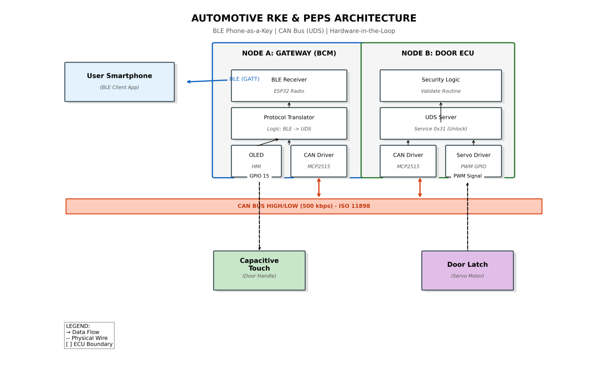

# Automotive-RKE-UDS-Simulation

**Remote Keyless Entry (RKE) / Phone-as-a-Key (PaaK) bench demo** using **BLE → UDS (ISO 14229) over CAN** between two ESP32 ECUs (Gateway BCM + Door ECU) with a HIL-style actuator.

> **description:**  
> ESP32 BLE Phone-as-a-Key demo translating BLE unlock to UDS RoutineControl (0x31) over 500 kbps CAN (MCP2515) to a Door ECU that actuates a servo latch and returns a 0x71 positive response.

---

## Overview

This project simulates a simplified vehicle **BCM/DCU architecture**:

- **Node A (Gateway / BCM)**: BLE server + touch “handle” input, sends UDS request on CAN.
- **Node B (Door ECU / DCU)**: receives UDS request, responds with positive ack, actuates a servo “door latch”.

---

## System Architecture



**Topology:**  
`Mobile (BLE) → Node A (Gateway BCM) → CAN Bus → Node B (Door ECU) → Servo Actuator`

---

## Key Features

- BLE “Unlock” command (GATT write)
- Capacitive “handle touch” input using ESP32 `touchRead()`
- UDS RoutineControl request/response on CAN IDs:
  - Request: **0x7E0**
  - Response: **0x7E8**
- Evidence package: HIL photo + CAN trace + demo video
- QA-style documentation: requirements, test plan, test cases, traceability

---

## Communication Protocol (UDS over CAN, Single-Frame)

**UDS Request (Gateway → Door)**
- CAN ID: `0x7E0`
- Data: `02 31 01 00 00 00 00 00`
  - `02` = ISO-TP Single Frame length (2 bytes payload)
  - `31` = RoutineControl
  - `01` = Routine ID (Unlock)

**UDS Positive Response (Door → Gateway)**
- CAN ID: `0x7E8`
- Data: `02 71 01 00 00 00 00 00`
  - `71` = Positive response for `0x31` (service + 0x40)
  - `01` = Routine ID echo

---

## Evidence

### 1) Demo Video (YouTube)
[](https://youtu.be/mN5SC-dQ7lI)

### 2) HIL Bench Photo


### 3) CAN Trace
- Full log: [`assets/evidence/canlog.md`](assets/evidence/canlog.md)

Capture (request + response):
```text
0.792830, RX, 0x7E0, 8, 02 31 01 00 00 00 00 00
0.793831, RX, 0x7E8, 8, 02 71 01 00 00 00 00 00
